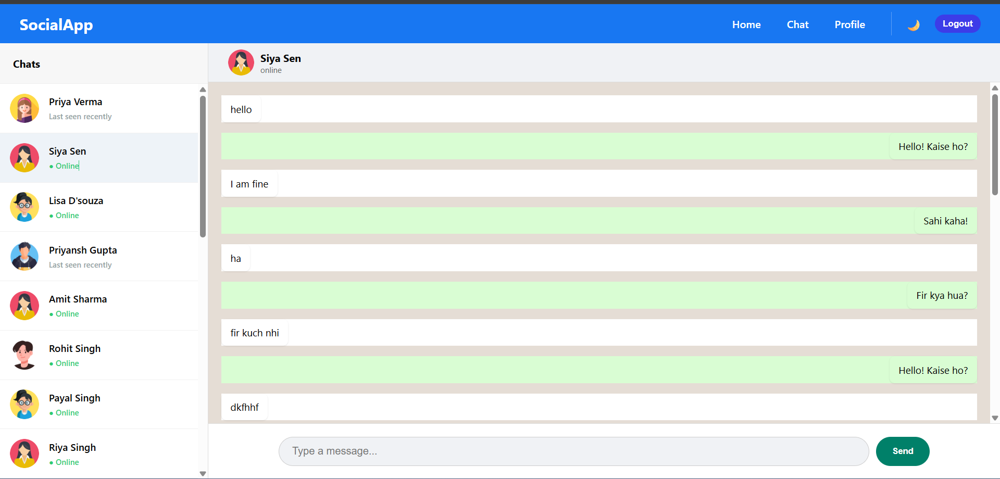
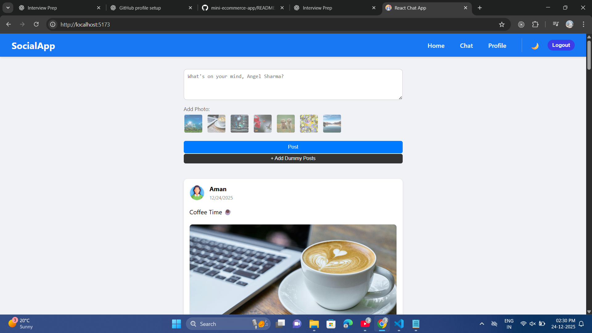

# 💬 Chat App (React) using firebase

A modern and responsive Chat Application built using **React**.and **firebase**  
This project demonstrates real-world frontend concepts like component-based architecture, state management, avatar pic also, conditional rendering, and clean UI design.

---

## 🚀 Features

- User-friendly chat interface
- And added some avatar also
- Real-time style message sending (UI-based)
- Separate chat list and chat window
- Message input with send button
- Real-time backend integration (Firebase )
- User authentication
- Online / offline status
- Clean and responsive design
- Reusable React components
- Proper folder structure

---

## 🛠️ Tech Stack

- React
- JavaScript (ES6)
- HTML5
- CSS3

---

## 📸 Screenshots

### Chat List Screen

### Chat Screen

### Home

---

##How to Run Locally

Clone the repository git clone https://github.com/PrernaSingh-90/chat-app.git
Install dependencies npm install
Start the project npm run dev

📚 What I Learned

- Building UI using reusable React components
- Managing state and props effectively
- Handling user input and events
- Structuring a React project professionally
- Writing clean and readable code
   
